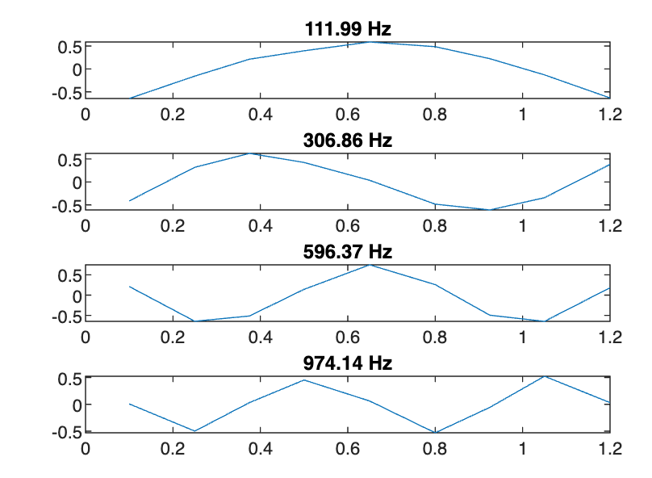

# ModeLAB
`ModeLab` is a MATLAB toolbox for performing modal analysis using experimental FRFs from roving hammer tests. This essentially recreates the functionality of `modalfrf` and `modalfit` in the Signal Processing toolbox but is FOSS.

A function called `read_signalcalc` has been included to read in ASCII files from DataPhysics SignalCalc, but this toolbox could be used with other software too with a custom defined file reader.

## Installation
Download the latest release and add the directories to your MATLAB `path`.

## Usage

### 1. Copy files
Copy the ASCII directories from SignalCalc to an appropriate location, which will be referred to `"C:\path\to\root\of\signal_calc\data"`. Also copy the `setup.csv` file from the `ModeLAB` folder to your new directory.  

Your directory should now have the following structure:

```
├── ASCII00001     
|  └ Hxysv00001.txt        
├── ASCII00002     
|  └ Hxysv00002.txt       
|
.
.
.
└ setup.csv
```
Note that the Run numbers do not matter (ie, it's fine if you skip some runs so the runs are numbered 1,2,6,10...). However, the order of the runs must be consistent with their ordering in the `setup.csv` from step 2.

### 2. Update `setup.csv`
Update the `setup.csv` file to reflect the setup of the roving hammer test. This has the following format:

    ```
    xHammer,0,0,0,0,0,0,0,0,0
    yHammer,0,0,0,0,0,0,0,0,0
    zHammer,0.1,0.25,0.375,0.5,0.65,0.8,0.925,1.05,1.2
    FxHammer,1,1,1,1,1,1,1,1,1
    FyHammer,0,0,0,0,0,0,0,0,0
    FzHammer,0,0,0,0,0,0,0,0,0
    xAccel,0,,,,,,,,
    yAccel,0,,,,,,,,
    zAccel,0.5,,,,,,,,
    axAccel,-1,,,,,,,,
    ayAccel,0,,,,,,,,
    azAccel,0,,,,,,,,
    fLMode,108,300,590,970,,,,,
    fHMode,116,312,600,980,,,,,
    fMin,65,,,,,,,,
    fMax,1000,,,,,,,,
    ```

where each row has the following meaning:
- `xHammer`, `yHammer` and `zHammer` contain the location of the hammer in each test in cartesian co-ordinates. Each column corresponds to each hammer test in the order they appear in `"C:\path\to\root\of\signal_calc\data"`. Note that the coordinate system you use is arbitray, but it must be consistent for both the impact and accelerometer locations.
- `FxHammer`, `FyHammer` and `FzHammer` contain the direction of each hammer impact.
- `xAccel` , `yAccel` and `zAccel` contain the locations of the accelerometers which are assumed to remain constant throughout.
- `axAccel` , `ayAccel` and `azAccel` contain the direciton of the accelerometers. 
- `fLMode` and `fHMode` contain the upper and lower bounds of each mode in Hz. The modes are _not_ automatically detected, so you must manually choose suitable ranges around each peak. You can typically get good enough estimtes from SignalCalc.
- `fMin` and `fMax` specify the miminmum and maximum frequency range to include when identifying the modes. The data outside this range is ignored.

### 3. Run the script
Call the top-level `modal_analysis` function to perform the modal analysis, usinf the following syntax:

```
modes = modal_analysis("C:\path\to\root\of\signal_calc\data")
```

which will process the data, generating many graphs showing the fit to the experimental data. The key output you will want is the  `modes` structure, containing the following fields:

- `modes.omega` contains the natural frequencies in rad/s
- `modes.zeta` contains the damping ratios as a fraction
- `modes.r` contains the nodes of the model in cartesian co-ordinates. This will be a superset of your impact and accelerometer locations.
- `modes.u` contains the mass-normalised deflection at each node
- `modes.n` contains the direction of the deflection at each node in cartesian co-ordinates.

## Example
A worked example has been included. This contains the results from a roving hammer test on a beam strucuture. An accelometer was placed at one location, and the beam was impacted a different locations along its length. Change your working directory to the root of `ModeLAB` and run the `run_example.m` script in the `Example` folder. This executes the following command to process the data and identify the modes:

```
modes = modal_analysis('.\Example\SignalCalc')

```

and then visualises the mode shapes of the beam as follows:

```
figure
for i = 1:4
    subplot(4,1,i)
    plot(modes.r(:,3), modes.u(:,i))
    title(sprintf('%0.2f Hz', modes.omega(i)/2/pi)
end

```

This should generate a plot like this:
